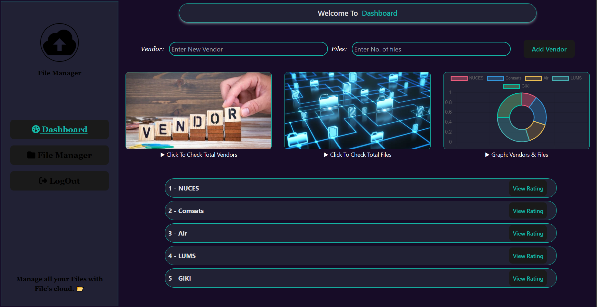
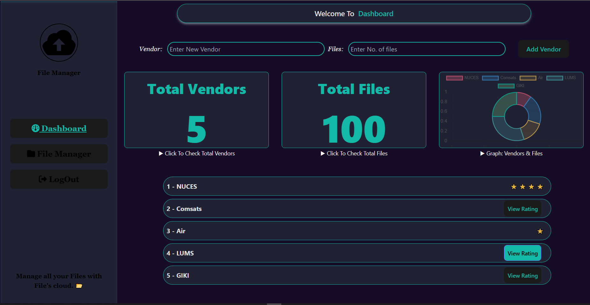
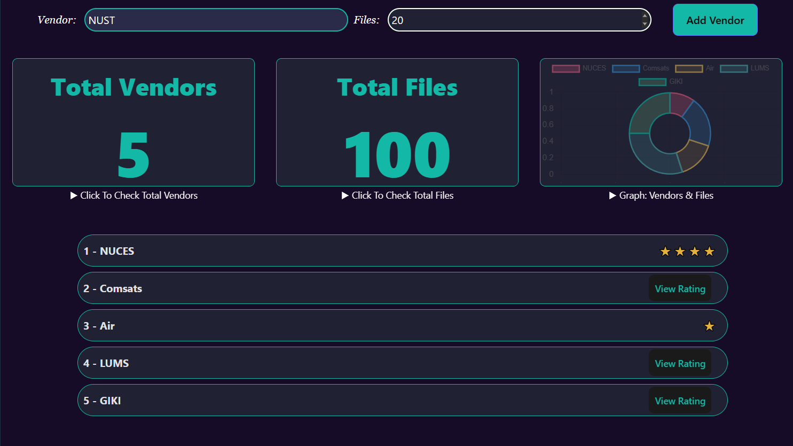
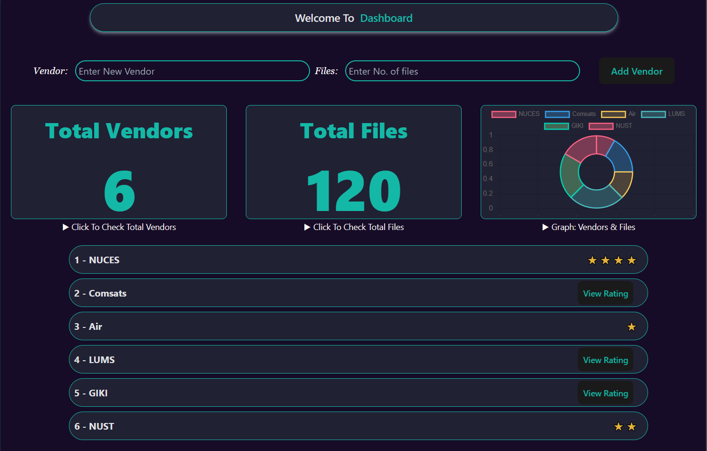
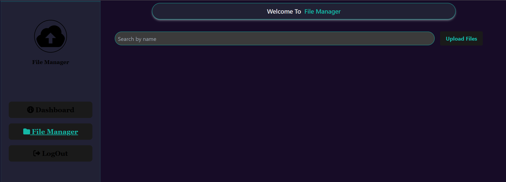
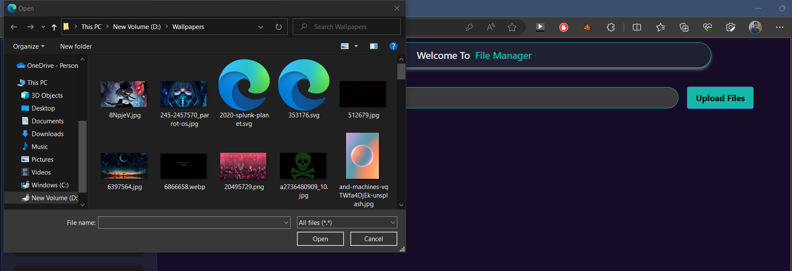
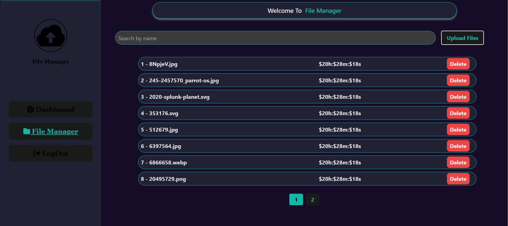
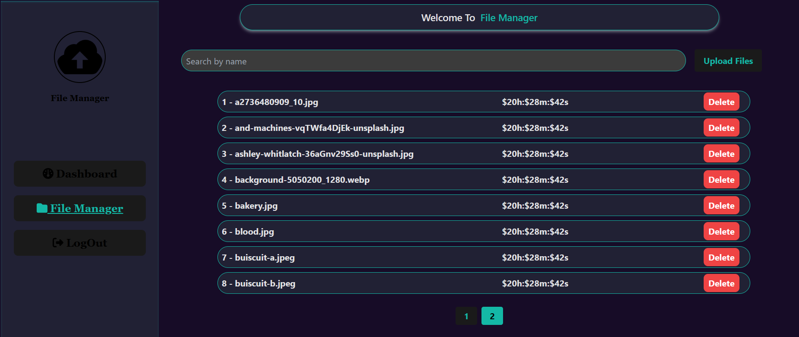
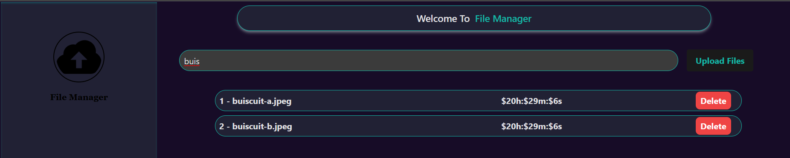

# File Management System
 This application is responsible for managing, uploading and deleting files. React pagination has also been used.

!st of all lets have a look at the login page for the application. For the login page i have implemented following checks:
* If there is an '@' missing in the email address then the form will not get submit and will ask the user for the correct email address format. similar will be the case for the '.' in the email address for TDLs.
* For password, there must be atleast 8 characters plus all 8 characters cannot be spaces.
* And last but not the least input fields cannot be left unfilled.
 
 Next, after clicking sign in, we get traversed to the dashboard of the application. This is the application dashboard interface. 
Following are the features implemented in dashboard.
* Flipable pictures for total vendors and their uploaded files.
* Graph representing the uploaded files corresponding their vendors.
* Add Vendor feature for the uploading of new files and vendors.
* All vendors and their ratings for the application 
 
  Now you can click on pics to check the total vendors and their file and you can click on view rating button to see the rating of corresponding vendors.  
 
  Below you can see that i am about to add a vendor named NUST with files  equals 20.  
 
  And you can see that a list element for NUST has been added, we can see its rating too. Also the total vendors and files have also been updated.  
 
 Now, let us take a look at the File Manager Page.  
 
  Just click Upload files button and this is the result.  
 
 I uploaded some 16 pics and you can see the uploaded filenames, their upload date and a delete button against each file list item. 
Also, the total files have also been divided in to 2 pages i.e., result of pagination. 
This is 1st Page  
 
  This is 2nd page.  
 
  Now, if i want to search files based on their names, just type in search bar as follows:  
 